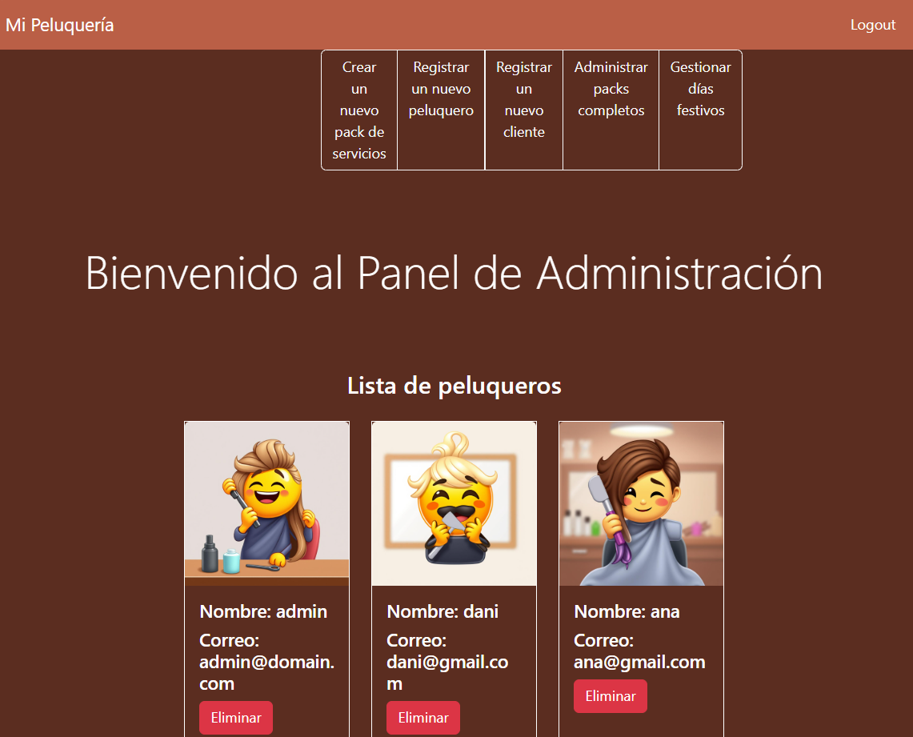
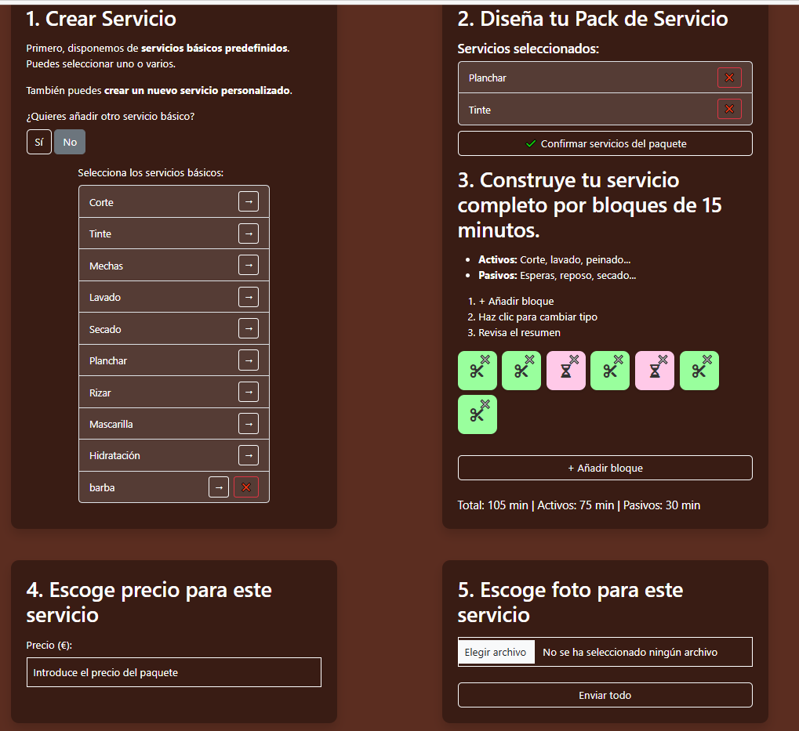
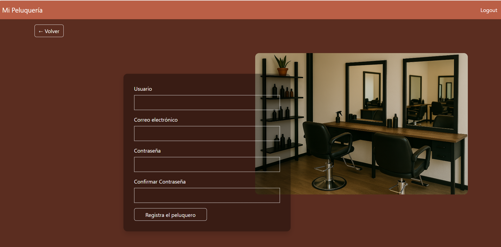
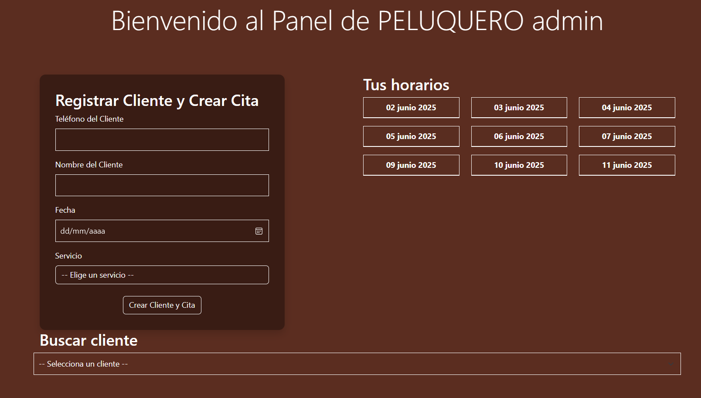
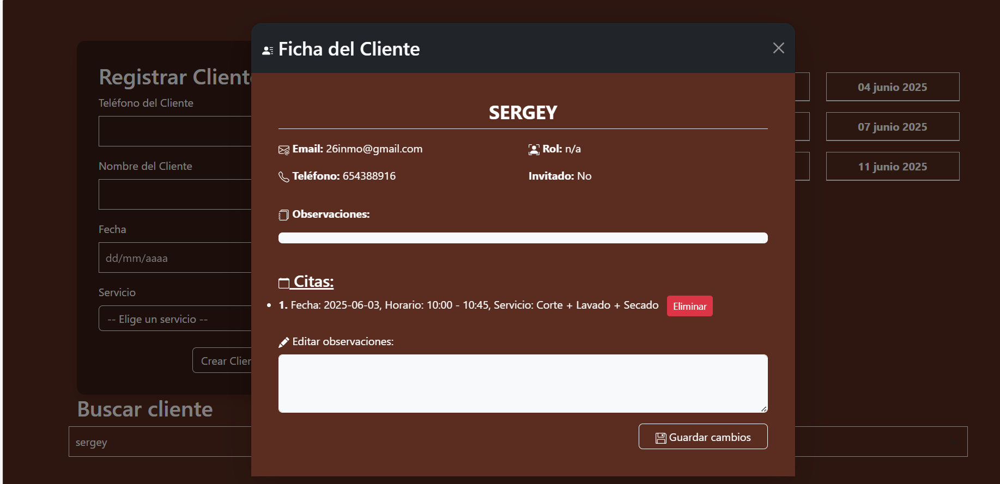
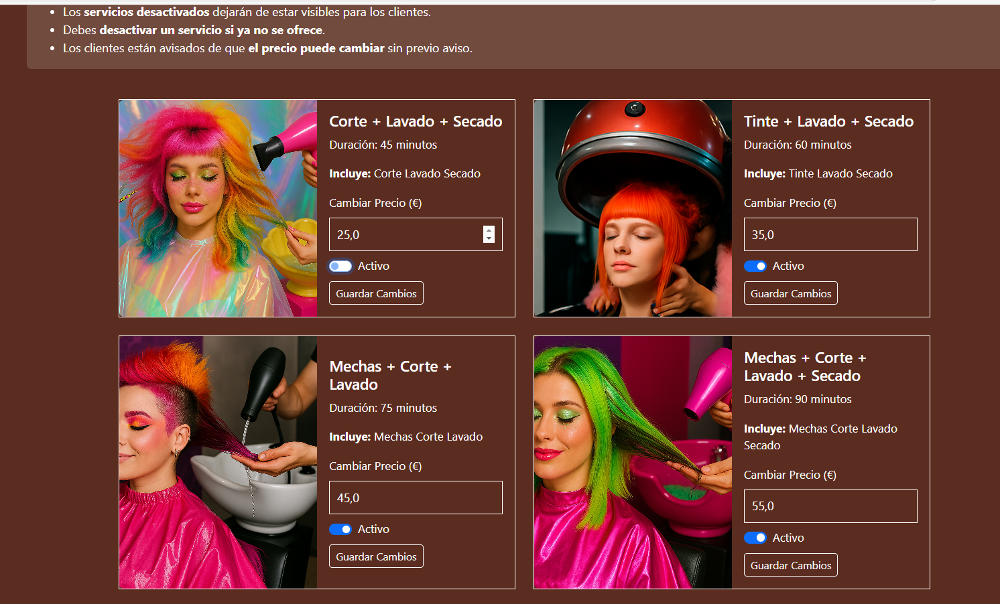
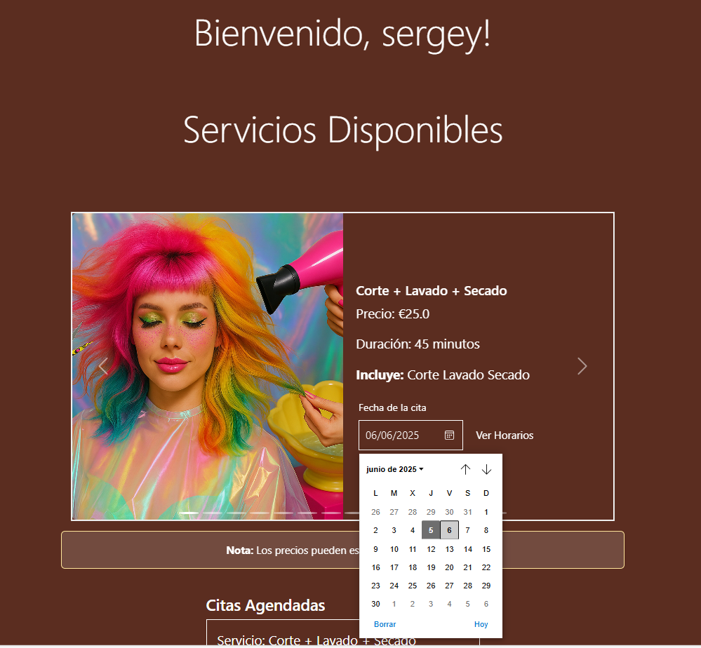
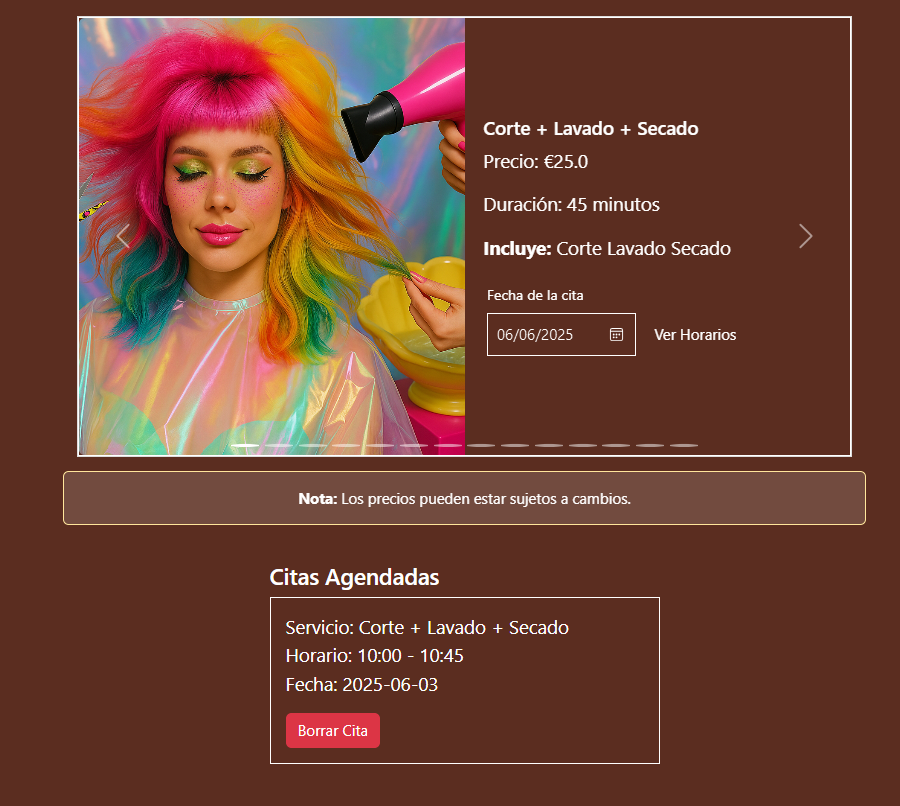

# CitaPeluqueriaApp

Aplicación web para la gestión de citas en una peluquería, diseñada para tres tipos de usuarios: **clientes**, **peluqueros** y **administradores**. La plataforma permite reservar, gestionar y cancelar citas de forma intuitiva y segura.

## Vídeo explicativo

Puedes ver una demostración completa de la aplicación en YouTube:

🔗 [Ver vídeo en YouTube](https://youtu.be/MOAafbfFkw4)
---

##  Tecnologías utilizadas

### Backend:
- Java 21
- Spring Boot
- Spring MVC
- Spring Security
- Maven
- MySQL

### Frontend:
- Thymeleaf (templating engine)
- HTML5
- CSS3
- JavaScript

### Otros:
- Bootstrap (diseño responsive)

---

##  Funcionalidades Principales

**CitaPeluqueriaApp** es una aplicación web pensada para facilitar la gestión de citas en una peluquería. Está diseñada para tres tipos de usuarios: clientes, peluqueros y administradores.

###  Gestión de usuarios
La aplicación contempla diferentes tipos de usuarios con distintos niveles de acceso:

- **Clientes registrados:** usuarios que crean una cuenta mediante registro con correo electrónico y contraseña. Estos usuarios pueden iniciar sesión, gestionar sus citas y su perfil personal. La creación de estos usuarios incluye validaciones de seguridad y confirmación vía correo electrónico.

- **Clientes invitados (“guest”):** usuarios que no disponen de cuenta ni acceso al sistema, y que son añadidos manualmente por los peluqueros (por ejemplo, tras una llamada telefónica o visita en persona). Estos clientes sólo disponen de los datos mínimos necesarios para la gestión de citas, sin contraseña ni acceso a funcionalidades online. Se diferencian mediante el campo booleano `guest` en la entidad `ClientEntity`.

- **Peluqueros:** usuarios registrados por el administrador, con permisos específicos para gestionar citas y clientes.

- **Administrador:** usuario con acceso completo al sistema.
- ### Razones para el manejo de clientes “guest”

En un entorno real de peluquería, es habitual que muchos clientes no utilicen plataformas digitales para gestionar sus citas. Para adaptarse a esta realidad, la aplicación permite manejar clientes “guest” sin necesidad de que se registren o gestionen una contraseña, facilitando su incorporación rápida y sencilla.

Este enfoque garantiza:

- Flexibilidad en la gestión de clientes.
- Sencillez para usuarios no tecnológicos.
- Seguridad, evitando crear accesos innecesarios para clientes sin cuenta.
### Esquema de la base de datos

Este es el diagrama ER (Entidad-Relación) que representa las principales entidades y relaciones del sistema:


###  Funciones del administrador



- Crear servicios simples y combinarlos en packs personalizados.
- Definir duración del servicio en segmentos de 15 minutos.
  

- Clasificar los segmentos como:
   - **Activos** (requieren intervención del peluquero)
   - **Pasivos** (el cliente está esperando algún efecto)
- Asignar imágenes, precios y disponibilidad.
- Registrar peluqueros y clientes (por ejemplo, por llamada telefónica).
  
  

- Asignar citas a clientes, con selección de fecha y franja horaria disponible.
- Consultar horarios disponibles por día.
- Añadir observaciones a los clientes.
- Cancelar citas.
  
- 
- Ver todos los servicios disponibles, editarlos o desactivarlos.
- Modificar precios sin afectar citas existentes.
  


- Establecer días festivos para bloquear disponibilidad.
  


###  Funciones del peluquero
- Acceder con su cuenta asignada.
- Gestionar las citas de sus propios clientes.
- Ver horarios disponibles, citas agendadas y detalles de cada servicio.
- No puede crear servicios nuevos ni modificar servicios y precios.

###  Funciones del cliente
- Registrarse y gestionar su perfil.

- Consultar todos los servicios y sus precios.
  

- Seleccionar una fecha y ver franjas horarias disponibles.
  

- Reservar una cita y visualizarla en su panel.
 

- Cancelar citas si es necesario.


##  Puesta en marcha local (modo desarrollador)

1. **Requisitos previos:**
    - Java 21 instalado
    - MySQL (con base de datos configurada)
    - IntelliJ IDEA o tu IDE favorito
    - Maven instalado (opcional si usas IntelliJ)

2. **Pasos:**
    - Clona este repositorio:
      ```bash
      git clone https://github.com/lmarazova/CitaPeluqueriaApp.git
      ```
    - Abre el proyecto con IntelliJ
    - Configura `application.properties` con tu conexión a MySQL
    - Ejecuta la clase principal: `CitaPeluqueriaAppApplication`
    - Abre el navegador: [http://localhost:8082](http://localhost:8082)

---

##  Usuarios de ejemplo

Puedes iniciar sesión con usuarios ficticios para probar la app:

- Cliente: `26inmo@gmail.com` / `123123`
- Peluquero: `dani@gmail.com` / `123123`
- Admin: `admin@domain.com` / `admin123`

*(Estos datos pueden cambiar según tu configuración actual.)*

---

##  Estructura del proyecto (resumen rápido)

- `config/`
 Configuraciones generales del sistema (seguridad, correo, beans...):

AdminUserCreator, AppConfig, CustomMailConfig, SecurityConfig

- `domain/`
 Modelos de datos y transferencia (DTOs y entidades):

   -- `dtos/`: DTOs usados en controladores y servicios (AppointmentDTO, ClientShowTableDTO, etc.)
    
   -- `entities/`: Clases que representan la base de datos (AppointmentEntity, ClientEntity, etc.)

- `enums/`
 Enumeraciones para roles, tipos de servicio y estados de slots:

HairService, Role, ServicePackageEnum, SlotStatus

- `init/`
 Carga automática de datos iniciales:

HairdresserInit, HairServiceInit, ServiceInit

- `mapper/`
 Conversores entre entidades y DTOs:

AppointmentMapper, ClientMapper, ServiceMapper

- `repositories/`
 Interfaces que gestionan el acceso a la base de datos:

AppointmentRepository, ClientRepository, etc.

- `scheduling/`
 Tareas programadas para mantenimiento:

SchedulerTasks

- `services/`
 Lógica de negocio principal del sistema:

AppointmentService, HairdresserService, SlotService, etc.

- `util/`
 Clases auxiliares para formato y utilidades:

Constants, HourFormatter, SlotConverter, SlotProcessor

- `webController/`
 Controladores web que manejan las peticiones y vistas:

ActivationController, AppointmentController, AdminController, etc.

- `templates/`: archivos Thymeleaf (.html) : add-holiday.html, admin.html, login.html, register.html, service-pack.html, etc.
- `static/`: CSS, JS, imágenes

---
##  Tests Unitarios

Los tests unitarios están ubicados en:  
`src/test/java/com/example/citaPeluqueria/`

###  ¿Qué cubren?

- **Mappers**: verifican que las conversiones entre entidades y DTOs funcionen correctamente.
- **Servicios**: prueban la lógica de negocio de clases como `HairServiceServiceImpl`, `SlotService`, etc.
- **Clases auxiliares** (`util/`): cubren métodos como formateadores de hora (`HourFormatter`, `SlotProcessor`).
- **Controladores individuales**: pruebas unitarias aisladas usando mocks de dependencias con Mockito.

Estos tests aseguran que cada componente funcione correctamente **de forma aislada**, antes de ser integrado en el sistema completo.


---
##  Tests de Integración
Este proyecto incluye una serie de **tests de integración** ubicados en:
src/test/java/com/example/citaPeluqueria/integration
###  ¿Qué cubren estos tests?

Los tests verifican que los distintos componentes del sistema funcionen correctamente **en conjunto**, accediendo a la base de datos real configurada en el entorno de desarrollo o test.

---

### 1. `SlotRestController`
- `GET /api/slots/{id}`: devuelve un turno completo (incluye peluquero, cliente, servicio).
- `GET /api/slots`: devuelve la lista de todos los turnos.

---

### 2.  `AppointmentRestController`
- `GET /api/appointments/{id}`: devuelve una cita con datos completos.
- `GET /api/appointments`: devuelve la lista total de citas.

---

### 3.  `ClientRestController` / `UserRestController`
- `GET /api/users/{id}`: devuelve un cliente junto con sus citas.
- `GET /api/users`: lista completa de clientes registrados.

---

### 4.  `ServiceRestController`
- `GET /api/services/{id}`: devuelve un servicio individual.
- `GET /api/services`: devuelve la lista completa de servicios.

---

### 5.  Repositorios (`@DataJpaTest`)
Se testean los métodos principales de persistencia:
- `SlotRepository`: guardar, buscar por ID, obtener lista.
- `AppointmentRepository`: guardar y consultar citas.
- `ClientRepository` y `ServiceRepository`: operaciones básicas de persistencia.

---

### 6. Tests end-to-end
Cobertura de flujos funcionales completos:
- Crear un cliente → crear una cita asociada → consultar la cita.
- Crear un slot → asignar peluquero y cliente → consultar el slot con todos los datos.

---

###  Cómo ejecutar los tests

Puedes ejecutarlos desde **IntelliJ IDEA** con el botón ▶️ que aparece en cada clase o método.

También puedes usar Maven desde la terminal:

```bash
mvn test
---
```

## Licencia

Este proyecto está bajo la Licencia MIT. Consulta el archivo [LICENSE](LICENSE) para más información.